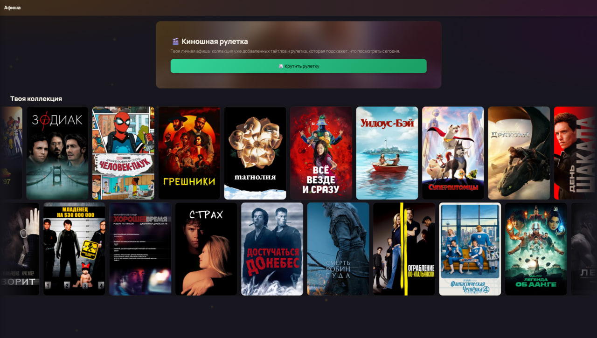
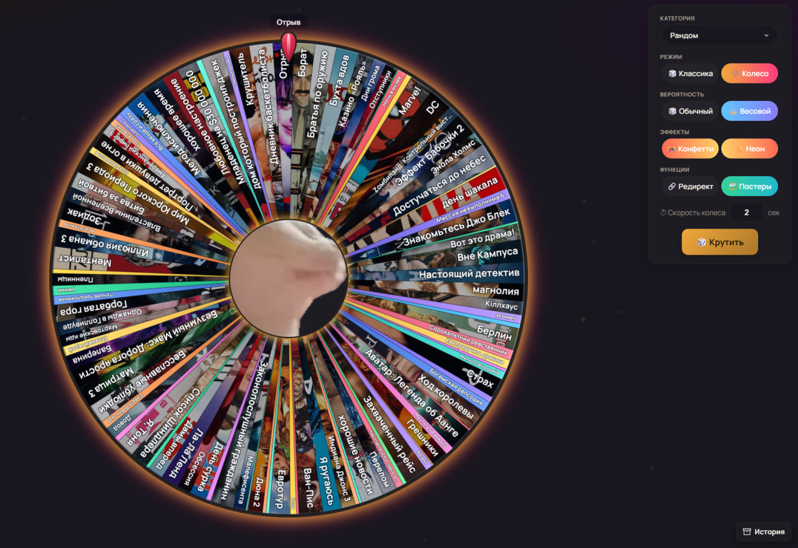
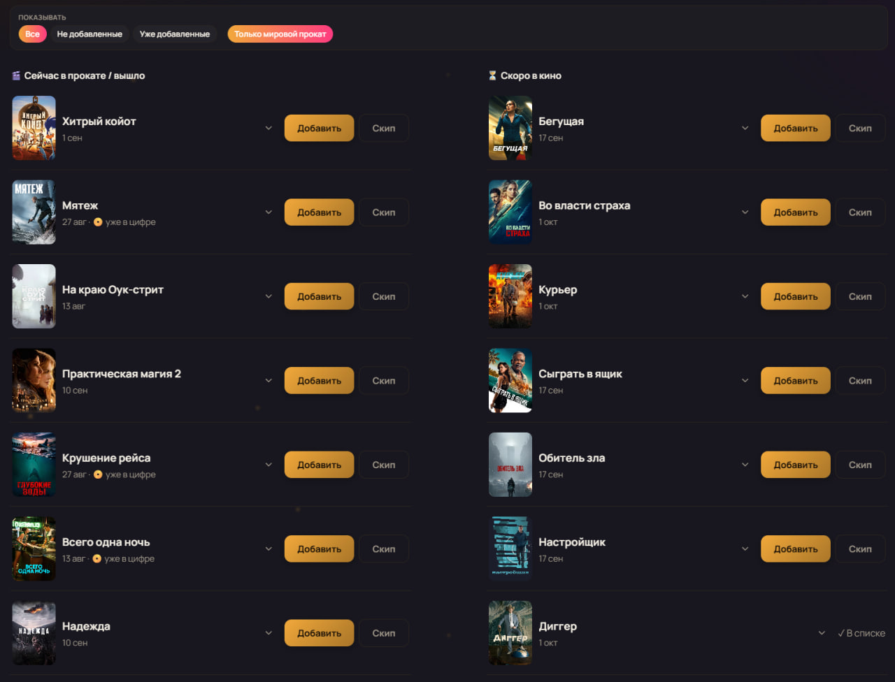
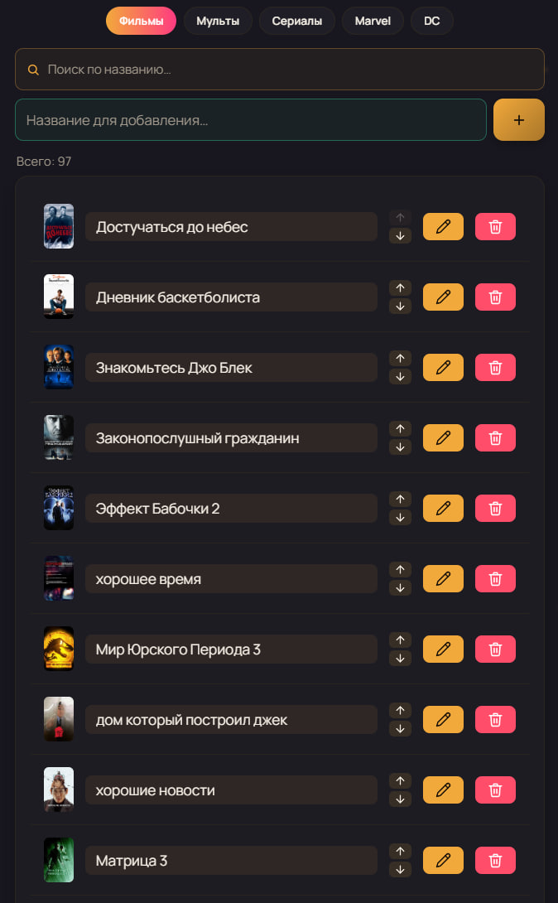

# 🎬 Filmroulette

A web app for deciding what to watch — home feed, a spin-the-wheel
roulette, theater & series-premiere tracking, personal watchlists,
and history for movies, TV series, and cartoons. Ships with a
companion Telegram bot for the core roulette/upcoming/history flows
on the go.

**The web app is the main product** — it has significantly more
features than the bot, which now mainly covers the essentials.

[](https://github.com/Redi38/filmroulettebot/actions/workflows/ci.yml)
[](LICENSE)
[](pyproject.toml)

## Screenshots

<!--
  Drop images into docs/screenshots/ using these file names (or update the
  paths below to match yours) and the gallery will pick them up automatically.
-->

| Home feed | Spin wheel |
| :---: | :---: |
|  |  |

| In theaters | Watchlist |
| :---: | :---: |
|  |  |

## 🌐 Web app

Browser-based frontend (FastAPI + plain HTML/CSS/JS) backed by TMDB
data and the same SQLite database as the bot:

- 🏠 **Home feed** — a curated poster feed across everything tracked.
- 🌀 **Spin wheel** — animated wheel-of-fortune roulette per category
  (movies / series / cartoons) or fully random across all of them,
  with weighted spins and a customizable center-hub image.
- 🎟 **In theaters** — what's currently playing and what's coming to
  theaters next, paginated.
- 📺 **Series premieres** — upcoming season/episode premiere dates.
- 🔔 **Series tracking** — search and follow specific shows to keep
  an eye on new releases.
- 📋 **Watchlists per category** — browsable, searchable lists for
  movies/series/cartoons with add, rename, and delete.
- 🦇🕷 **Marvel & DC showcases** — dedicated studio collections, with
  the option to add titles straight to your list.
- 🕰 **Upcoming** — a personal list of anticipated titles not out yet.
- 📜 **History** — everything the roulette has already picked, with
  the ability to resolve or delete entries.

## 🤖 Telegram bot

A lighter, chat-based companion covering the core flows:

- 🎰 **Roulette** — random pick of a movie, TV series, or cartoon
  (`/start`, "🎬 Movie Roulette" / "📺 Series Roulette" /
  "🎥 Cartoon Roulette", "🔄 Start" for a fully random genre).
- 🦇🕷 **DC & Marvel** lists — `/dc`, `/marvel`.
- 🕰 **Upcoming** — `/upcoming`, `/add_upcoming <title>`.
- 📜 **History** — `/history`, `/clear_history`.
- 🔗 Optional "where to watch" link via `WATCH_LINK_TEMPLATE`.

## Quick start (Docker)

```bash
git clone https://github.com/Redi38/filmroulettebot.git
cd filmroulettebot
cp .env.example .env    # fill in TOKEN and TMDB_API_KEY
make up                 # docker compose up -d --build (bot + web + autoheal)
```

The web app comes up on `http://localhost:8010`.

## Local setup (no Docker)

```bash
make venv && source .venv/bin/activate
make install-dev
cp .env.example .env    # fill in TOKEN and TMDB_API_KEY

make js-install && make js-build           # build the frontend JS bundle (once)

uvicorn app.web.server:app --reload --port 8000   # the web app
# and/or
python main.py                                   # the Telegram bot
```

`make help` lists the rest of the dev shortcuts (`make ci`, `make test`,
`make lint`, `make typecheck` — the same checks CI runs).

### Frontend JS build

`app/web/static/js/` is plain, framework-free JS (no bundler-required
import/export) — but the ~30 files under it are concatenated and minified
into a single `dist/bundle.min.js` by [esbuild](https://esbuild.github.io/)
so the page loads with one request instead of ~30. That's a build artifact
(gitignored, built fresh in Docker), so if you're running the app directly
with `python`/`uvicorn` rather than Docker, build it once after cloning and
again after editing anything under `static/js`:

```bash
make js-install   # npm install (esbuild)
make js-build     # one-off build
make js-watch     # or: rebuild on every save
```

File order matters (plain scripts share globals, no module resolution) —
it's defined once in `app/web/static/js/manifest.json`.

## Configuration (`.env`)

| Variable | Required | Description |
| --- | --- | --- |
| `TOKEN` | ✅ | Telegram bot token ([@BotFather](https://t.me/BotFather)) |
| `TMDB_API_KEY` | ✅ | [TMDB](https://www.themoviedb.org/settings/api) API key |
| `HISTORY_CLEAR_LIMIT` | — | Threshold for `/clear_history` (default `10`) |
| `DB_PATH` | — | SQLite database path (default `bot_data.db`) |
| `LOG_LEVEL` | — | Logging level (default `INFO`) |
| `WATCH_LINK_TEMPLATE` | — | "Where to watch" link template |

## Stack

Python 3.12+ · FastAPI + Uvicorn (web app) · [aiogram 3](https://docs.aiogram.dev/) (bot) ·
SQLite (aiosqlite) · httpx (TMDB) · plain HTML/CSS/JS frontend.

## License

[MIT](LICENSE)
